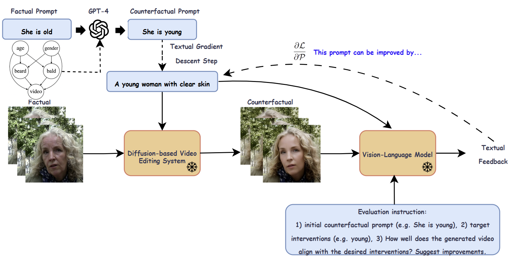

# Causally Steered Diffusion for Automated Video Counterfactual Generation


[Preprint](https://arxiv.org/abs/2506.14404)
## Enviroment
```
conda create -n crf_video python=3.12.9
conda activate crf_video
pip install -r requirements.txt
```
## Preprocess
### Tune-A-Video
To fine-tune the T2I model for video editing, inside `counterfactual_video/` run the following command:
```
python train_tuneavideo.py --base_config methods/tuneavideo/configs/config_tune.yaml --source_prompts data/celebv_bench/source_prompts.json --data_dir data/celebv_bench/frames
```
### TokenFlow
Inside `counterfactual_video/methods/tokenflow/`, run the following command to produce the inverted latents:
```
python preprocess_all.py 
```

## Inference with baseline editing methods
To produce counterfactual videos using the vanilla editing methods, specify the method, the corresponding config file, and the initial counterfactual prompts. We provide an example with TokenFlow.
```
python inference.py --method tokenflow --base_config_path config_pnp.yaml --crf_config_path data/celebv_bench/counterfactual_explicit.json
```

## VLM Causal Steering
To produce counterfactual videos using our proposed VLM causal steering, use the following command. You will need an OpenAI API key.
We provide an example with TokenFlow.
```
python counterfactual_editor.py --method tokenflow --base_config_path methods/tokenflow/configs/config_pnp.yaml --crf_config_path data/celebv_bench/counterfactual_explicit.json
```

```
method: video editing baseline method to be used.
base_config_path: path to the configuration file corresponding to the selected method.
crf_config_path: path to the file containing the initial counterfactual (target) prompts.
```
## VLM-based metrics
### Causal effectiveness


Inside `counterfactual_video/vlm_metrics` run:
```
python effectiveness_llava.py --outputs_path /path/to/generated_videos tokenflow --method tokenflow --questions_path ../data/celebv_bench/questions_explicit.json
```
`questions_explicit.json` file contains the mutliple-choice questions extracted from the initial counterfactual prompts.

### Minimality


Inside `counterfactual_video/vlm_metrics`,  use the following command. You will need an OpenAI API key:
```
python gpt_minimality.py --model gpt-4o --outputs_path /path/to/generated_videos --method tokenflow --crf_config_path ../data/celebv_bench/counterfactual_explicit.json
```

## Dataset
###  [CelebV-Text](https://github.com/CelebV-Text/CelebV-Text)
The complete dataset is available at: https://drive.google.com/drive/folders/1Jv4-H6lnegbfDrTZW0ZfrKxZbouWl53M?usp=sharing.

The file `counterfactual_video/data/celebv_bench/samples.txt` contains the video identifiers used in our evaluation dataset. Additionally, in `counterfactual_video/data/celebv_bench/frames` we provide the frames extracted from each video.

## VLM Causal Steering Results
    
  


## Credits
This project builds upon the excellent work of the following repositories. We sincerely thank the authors for their open-source contributions:
*  [Tune-A-Video](https://github.com/showlab/Tune-A-Video/tree/main)
*  [FLATTEN](https://github.com/yrcong/flatten/tree/main)
*  [TokenFlow](https://github.com/omerbt/TokenFlow)
*  [textgrad](https://github.com/zou-group/textgrad/tree/main)
*  [awesome-diffusion-v2v](https://github.com/wenhao728/awesome-diffusion-v2v)
*  [common_metrics_on_video_quality](https://github.com/JunyaoHu/common_metrics_on_video_quality)
*  [CelebV-Text](https://github.com/CelebV-Text/CelebV-Text)


## Citation
```
If you find this work helpful in your research, cite:
@article{spyrou2025causally,
  title={Causally Steered Diffusion for Automated Video Counterfactual Generation},
  author={Spyrou, Nikos and Vlontzos, Athanasios and Pegios, Paraskevas and Melistas, Thomas and Gkouti, Nefeli and Panagakis, Yannis and Papanastasiou, Giorgos and Tsaftaris, Sotirios A},
  journal={arXiv preprint arXiv:2506.14404},
  year={2025}
}
```
